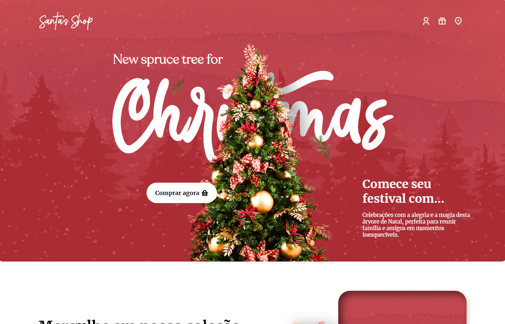

# Santa Shop 🎄

Bem-vindo ao **Santa Shop**, uma loja online temática de Natal que oferece uma experiência festiva completa para quem busca decorar e celebrar a época mais alegre do ano! Este projeto foi desenvolvido com HTML, CSS e JavaScript para criar uma interface visualmente agradável e fácil de usar.

## Descrição do Projeto

Santa Shop é um site de e-commerce fictício que apresenta uma coleção exclusiva de produtos de Natal, desde árvores decorativas até brinquedos, presentes e enfeites. O layout foi projetado para incentivar os visitantes a explorar a loja e concluir suas compras natalinas em um só lugar.

### Funcionalidades Principais

- **Navegação Simplificada**: Com links para perfis, presentes e localização, proporcionando acesso rápido a informações e produtos.
- **Produtos em Destaque**: Uma seção inicial com um produto promocional e uma chamada para ação (CTA) de compra.
- **Coleção Festiva**: Uma seção dedicada aos itens festivos, incentivando o usuário a explorar a variedade de produtos.
- **Categorias de Produtos**: Lista de categorias para facilitar a navegação e a descoberta de produtos específicos, como brinquedos, presentes e decorações.
- **Lista de Compras de Natal**: Uma seção que destaca itens populares e essenciais para uma celebração completa.
- **Formulário para Cupons**: Inscrição para ganhar cupons de desconto e promoções exclusivas.
- **Rodapé com Links e Redes Sociais**: Links úteis para páginas institucionais e redes sociais, promovendo o engajamento dos usuários.

## Tecnologias Utilizadas

- **HTML5**: Estruturação do conteúdo.
- **CSS3**: Estilização e design visual.
- **JavaScript**: Interatividade e animações leves.
- **Biblioteca Remix Icon**: Ícones para navegação e redes sociais.
- **ScrollReveal.js**: Efeitos de animação para uma experiência visual aprimorada.

## Estrutura do Projeto

Abaixo está uma visão geral das principais seções do site:

- **Header**: Navegação, logo, e um banner promocional com uma chamada para ação.
- **Seção de Coleção Festiva**: Descrição e botão para explorar a coleção completa de itens natalinos.
- **Categorias de Produtos**: Seção com cartões de produtos organizados por categoria.
- **Lista de Compras de Natal**: Produtos populares com preços e imagens.
- **Decoração da Temporada**: Destaque para guirlandas e outros itens decorativos.
- **Formulário para Cupons**: Inscrição para receber descontos.
- **Footer**: Links institucionais, redes sociais e informações de direitos autorais.

